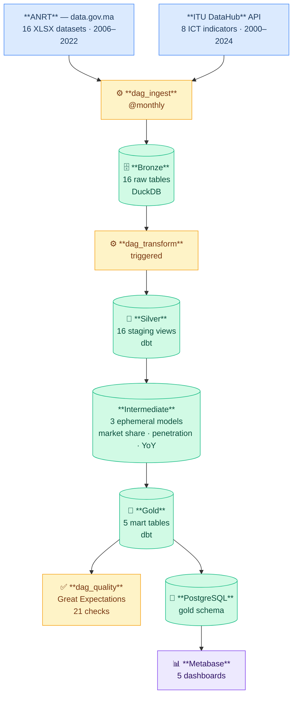
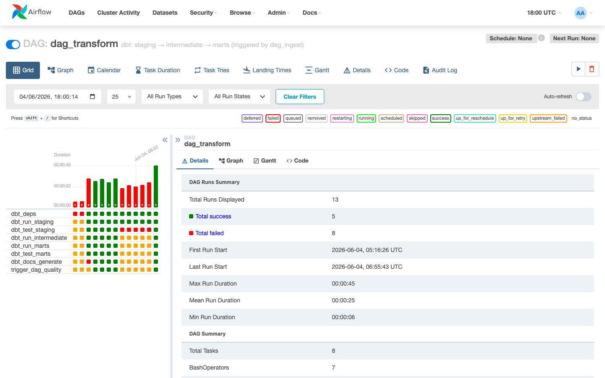
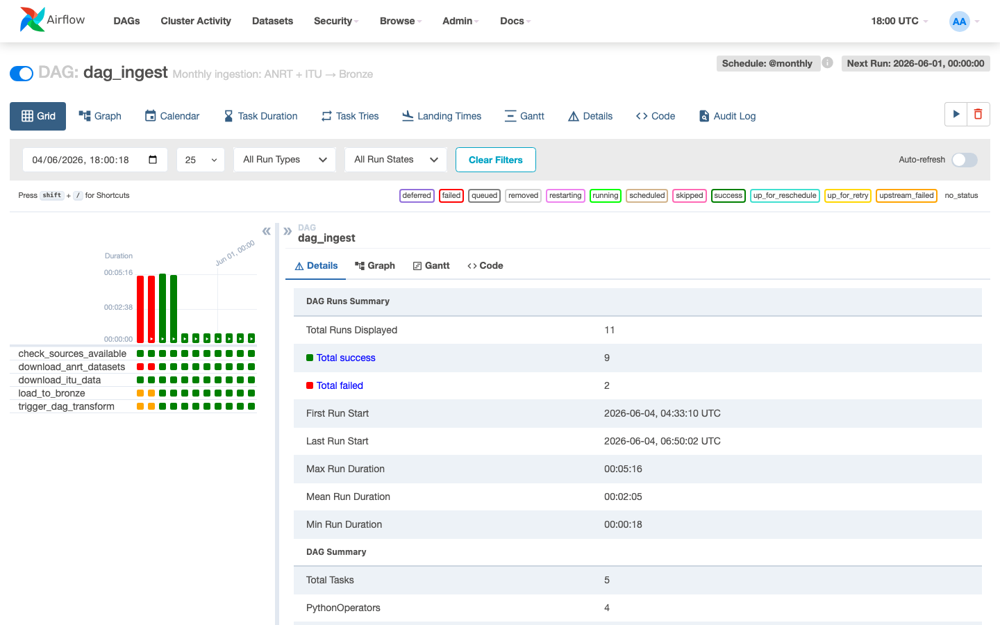
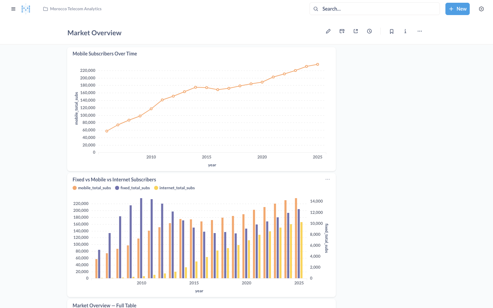
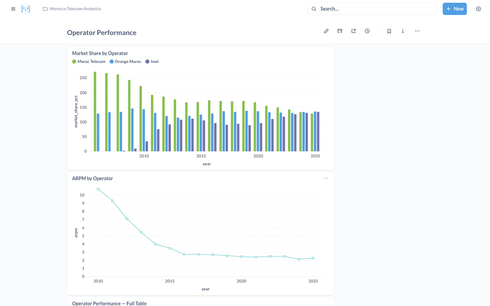
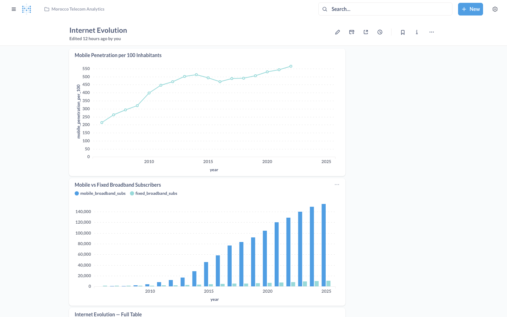
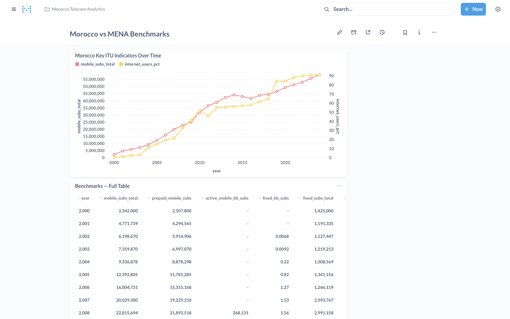

# Morocco Telecom Analytics

End-to-end data engineering pipeline that ingests Moroccan telecom market data from **ANRT** (data.gov.ma) and **ITU DataHub** into a DuckDB warehouse, transforms it with dbt using a Bronze / Silver / Gold medallion architecture, orchestrates everything with Apache Airflow, and visualises results in Metabase — all running locally via Docker Compose.

---

## Architecture



---

## Tech Stack

| Tool | Version | Role |
|---|---|---|
| Python | 3.11 | Extraction scripts + Airflow operators |
| Apache Airflow | 2.8.0 | Orchestration — 3 DAGs |
| dbt-core | 1.7.0 | Silver + Gold transformations |
| dbt-duckdb | 1.7.0 | dbt adapter for DuckDB |
| DuckDB | 1.5.3 | Local analytical warehouse — single-file, zero-infra, columnar; ideal for a local pipeline where you want fast analytical queries without running a server |
| Great Expectations | 0.18.0 | Data quality checks |
| PostgreSQL | 15 | Airflow metadata store + Gold layer export target for Metabase |
| Metabase | 0.49.7 | Dashboards — connected to PostgreSQL, not DuckDB directly (see [ARCHITECTURE.md](ARCHITECTURE.md)) |
| Docker Compose | — | Local orchestration of all services |

---

## Data Sources

### ANRT — data.gov.ma
16 XLSX datasets downloaded via the CKAN API (no auth, ODbL licence), covering mobile subscriptions, internet, fixed telephony, QoS, traffic, ARPM, bandwidth, complaints, portability, usage averages, IP addresses, data links, TIC surveys, domain names, and payphones.

**Data range: 2006–2022.** ANRT does not publish open data beyond 2022. The pipeline ingests all available years on every run; no 2023–2024 ANRT data exists in the source.

### ITU DataHub
8 ICT indicators for Morocco fetched from the ITU REST API — mobile subscriptions, fixed broadband, internet users %, international bandwidth, mobile revenue. **Data available through 2024**, filling the ANRT gap for macro benchmarks.

---

## Screenshots

> To run the pipeline locally and see the dashboards: follow the Quick Start below, then open http://localhost:3000.

| | |
|---|---|
|  |  |
| *Airflow — dag_transform (8 tasks)* | *Airflow — dag_ingest (5 tasks)* |
|  |  |
| *Metabase — Market Overview* | *Metabase — Operator Performance* |
|  |  |
| *Metabase — Internet Evolution* | *Metabase — Morocco vs MENA Benchmarks* |

---

## Project Structure

```
morocco-telecom-analytics/
├── Dockerfile                  # Custom Airflow image (dbt + DuckDB + GE pre-installed)
├── Dockerfile.metabase         # Custom Metabase image (libstdc++ for Alpine)
├── docker-compose.yml
├── requirements.txt
├── .env.example                # Template — copy to .env and fill secrets before starting
├── ARCHITECTURE.md             # Naming conventions, layer contracts, source API details
├── ingestion/
│   ├── anrt_extractor.py       # CKAN API → 16 XLSX datasets → Bronze
│   ├── itu_extractor.py        # ITU API → Bronze
│   └── export_to_postgres.py   # DuckDB Gold → PostgreSQL (for Metabase)
├── airflow/
│   ├── dags/
│   │   ├── dag_ingest.py       # @monthly: sources → Bronze
│   │   ├── dag_transform.py    # triggered: dbt staging → marts
│   │   └── dag_quality.py      # triggered: Great Expectations checkpoints
│   └── plugins/
│       └── ge_runner.py        # GE validation runner (imported by dag_quality)
├── dbt/
│   ├── models/
│   │   ├── staging/            # 16 stg_ models (Silver layer, views)
│   │   ├── intermediate/       # 3 int_ models (ephemeral)
│   │   └── marts/              # 5 mart_ models (Gold layer, tables)
│   ├── seeds/                  # dim_operator, dim_population (through 2024), dim_period (through 2024)
│   └── tests/                  # 5 custom singular tests
├── scripts/
│   └── create_metabase_dashboards.py   # Metabase API — creates/updates 5 dashboards (idempotent)
└── data/
    ├── raw/                    # Downloaded XLSX + CSV files (gitignored)
    └── warehouse.duckdb        # DuckDB warehouse (gitignored)
```

---

## Quick Start

### Prerequisites
- Docker + Docker Compose
- ~4 GB RAM available for containers

### 1. Clone and configure

```bash
git clone https://github.com/SouhailBourhim/Moroccan-Telecom-Analytics.git
cd Moroccan-Telecom-Analytics
cp .env.example .env
# Edit .env — set POSTGRES_PASSWORD and AIRFLOW_WWW_PASSWORD at minimum
```

### 2. Start all services

```bash
docker compose up -d --build
```

This starts: PostgreSQL · Airflow (webserver + scheduler) · Metabase.
First build takes ~5 minutes as it installs dbt, DuckDB, and Great Expectations into the Airflow image.

### 3. Run the pipeline

```bash
docker compose exec airflow-scheduler \
  airflow dags trigger dag_ingest
```

`dag_ingest` → `dag_transform` → `dag_quality` chain triggers automatically. Full run takes ~3 minutes.

### 4. Set up Metabase dashboards

Once the pipeline has run at least once:

```bash
# Export gold mart tables to PostgreSQL
docker compose exec airflow-scheduler \
  python3 /opt/airflow/ingestion/export_to_postgres.py

# Create/update dashboards (reads METABASE_TOKEN, METABASE_DB_ID, METABASE_COLLECTION_ID from env)
export METABASE_TOKEN=<session-token>
export METABASE_DB_ID=<db-id>
export METABASE_COLLECTION_ID=<collection-id>
python3 scripts/create_metabase_dashboards.py
```

---

## Services

| Service | URL | Credentials |
|---|---|---|
| Airflow UI | http://localhost:8080 | admin / (AIRFLOW_WWW_PASSWORD from .env) |
| Metabase | http://localhost:3000 | admin@morocctelecom.local / Admin1234! |

---

## Dashboards

Five dashboards in the **Morocco Telecom Analytics** Metabase collection:

| Dashboard | Contents |
|---|---|
| Market Overview | Mobile, fixed, internet subscribers over time |
| Operator Performance | Market share, ARPM, traffic, complaints by operator |
| QoS Scorecard | Voice call success rate and network quality indicators |
| Internet Evolution | Broadband penetration, mobile vs fixed broadband |
| Morocco vs MENA Benchmarks | ITU indicators: subscriptions, bandwidth, internet users % |

---

## DAG Chain

```
dag_ingest  (@monthly)
  ├── check_sources_available
  ├── download_anrt_datasets  ┐ parallel
  ├── download_itu_data       ┘
  ├── load_to_bronze
  └── trigger → dag_transform

dag_transform  (triggered)
  ├── dbt_deps
  ├── dbt_run_staging → dbt_test_staging     ← --fail-fast
  ├── dbt_run_intermediate
  ├── dbt_run_marts → dbt_test_marts         ← --fail-fast
  ├── dbt_docs_generate                      ← retries=4, 10s back-off
  └── trigger → dag_quality

dag_quality  (triggered)
  ├── ge_checkpoint_bronze   ┐
  ├── ge_checkpoint_silver   ├── each pushes CheckResult to XCom
  ├── ge_checkpoint_gold     ┘
  └── publish_quality_report  ← pulls XCom, writes timestamped report
```

---

## Medallion Layers

| Layer | Schema | Materialisation | Count |
|---|---|---|---|
| Bronze | `main` | Tables | 16 raw tables, exact copy of source |
| Silver | `silver` | Views | 16 `stg_` models — cast, rename, normalize |
| Intermediate | — | Ephemeral | 3 `int_` models — business logic only |
| Gold | `gold` | Tables | 5 `mart_` models — analytics-ready |

---

## Data Quality

### dbt tests (blocking — pipeline fails on error)
- `not_null` on all key columns across Bronze, Silver, Gold
- `accepted_values` on `quarter` (Q1–Q4), `operator` (3 names), `technology` (5 types), `indicator_code` (8 ITU codes)
- `unique_combination_of_columns` on `(year, quarter, operator)` in stg_mobile and stg_internet
- `dbt_utils.accepted_range` on `market_share_pct` [0, 100] and `mobile_penetration_per_100` [0, 200]
- Source freshness: warn > 90 days, error > 180 days
- **5 custom singular tests:** positive subs, market share sums to 100, market share bounds (95–105%), no empty Gold tables, quarterly time continuity

### Great Expectations (non-blocking — report to `data/ge_reports/`)
- **Bronze:** row count ≥ 10 per table (auto-discovered — new tables picked up automatically)
- **Silver:** mobile subscribers non-negative, penetration in [0, 200]
- **Gold:** Maroc Telecom market share median in [30, 60], no null KPIs, benchmarks ≥ 15 years
- Timestamped report filenames prevent same-day overwrites

---

## Implementation Phases

| Phase | What was built | Status |
|---|---|---|
| 1 | Repo scaffold: docker-compose, requirements, seeds, .env.example, directory structure | ✅ |
| 2 | `anrt_extractor.py`: CKAN API loop, universal XLSX parser, Bronze loader for 16 datasets | ✅ |
| 3 | `itu_extractor.py`: ITU REST API discovery, 8 indicators → `bronze_itu_morocco` | ✅ |
| 4 | dbt init: profiles.yml, dbt_project.yml, packages.yml, seeds, sources.yml | ✅ |
| 5 | 9 staging models + schema tests (Silver layer) | ✅ |
| 6 | 3 intermediate + 5 mart models + tests (Gold layer) | ✅ |
| 7 | 3 Airflow DAGs (17 tasks total), TriggerDagRunOperator chain | ✅ |
| 8 | Great Expectations fluent API runner, checks across 3 layers | ✅ |
| 9 | Metabase dashboards via PostgreSQL export; 5 dashboards live | ✅ |
| Improvements | Security, reliability, test coverage, 7 missing staging models | ✅ |
| End-to-end | First full Docker run: 17/17 DAG tasks ✅ · 68 dbt tests ✅ · 21/21 GE checks ✅ | ✅ |

Full per-phase notes and improvement details in [`docs/`](docs/).
